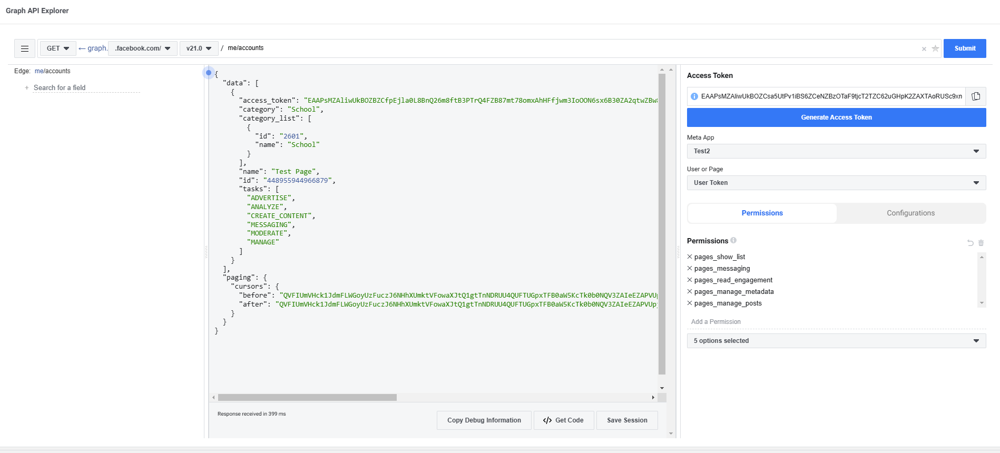

# Quick Installation Guide
---
This project is for our CS Elective 3 Project at Pamantsan ng Lungsod ng Maynila. This is our take on the PLM Website with Content Management System.

The following are the prerequisites to use the repository:

## General Notes
- The following are used in this developement: `node v20.17.0`, `npm v10.8.3`, `xampp`
- `npm i` or `npm install` should be ran in the following folders: `backend`, `frontend` and `server` 
---

## Server Requirements
- In the `server` folder, the following are listed inside the `.env` file: `database information` and `facebook app information`
- For the `database information`, it will contain the following: `DB_HOST`, `DB_PASSWORD`, `DB_NAME`, `DB_PORT`
- the database structure is provided within the `server` folder inside `sql` folder
- This will vary from user to user, check `phpmyadmin` for the database information
- For the `facebook app information`, if you want to use the application that i am using, it needs a prior request. If you want to setup your own application, refer to the next section
---

## Facebook API
- Visit the [Facebook Developer Website](https://developers.facebook.com/) and sign up.
- Things to make sure: 
    - You should have a Facebook Developer Accounts. If you do not have account, create one.
    - Make sure that you have access to the facebook page you want to try the application for. See image below to see when you have access to a page.
    - Switch to the Page

    - In the Settings Option, Search for Page Access

  
    - You should see your account in the list of 'People with Facebook Access'

- Once signed up, create your own application with the following specific settings: `Use Case = Other`, `App Type = Business`
    - Go to My Apps
    
    
    - Create App

    

    - Follow the required field
    - Select Other

    

    - Select Business

    
    
    - Create the App
- Once the application is created retrieve the following: `APP_ID`, `APP_SECRET`, `PAGE_ID`, `ACCESS_TOKEN`
    - For `APP_ID` and `APP_SECRET` you can see it in the App Settings

    

    - `PAGE_ID` and `ACCESS_TOKEN`, use the [Graph API Explorer](https://developers.facebook.com/tools/explorer/) which can be found in the tools tab
    
    
- The prior mentioned items are will be instered inside the `.env` of the server folder
- You can test out Facebook's APIs thought [Graph API Explorer](https://developers.facebook.com/tools/explorer/)

### Application Permissions
- This can be found in the [Graph API Explorer](https://developers.facebook.com/tools/explorer/)
- Allow the application to do the following: `pages_show_list`, `pages_messaging`, `pages_read_engagement`, `pages_manage_metadata`, `pages_manage_posts`
- Choose what page do you want the application to have access to after clicking `Generate Access Token`

### PAGE ID
- In order to get the Page Id, run this line in the [Graph API Explorer](https://developers.facebook.com/tools/explorer/) `/me/accounts`

- Retrieve the `Page_Id`
- Also take note of the `ACCESS_TOKEN` given by the prompt, this will be used to retrieve the access token

### ACCESS TOKEN
- There are two types of access token: Short-Lived and Long-Lived Access Token
- There is no Permanent Access Token
- For convenience, convert the short-lived access token retrieved from the page information
- Run this in the [Graph API Explorer](https://developers.facebook.com/tools/explorer/):
`oauth/access_token?grant_type=fb_exchange_token&client_id={app-id}&client_secret={app-secret}&fb_exchange_token={short-lived-access-token}`
- Replace the details enclosed in curly braces ({}) to retrieve your long lived access token
- This has at most 60 days life span, so every 2 months the access code needs to be renewed in order to be used again.

